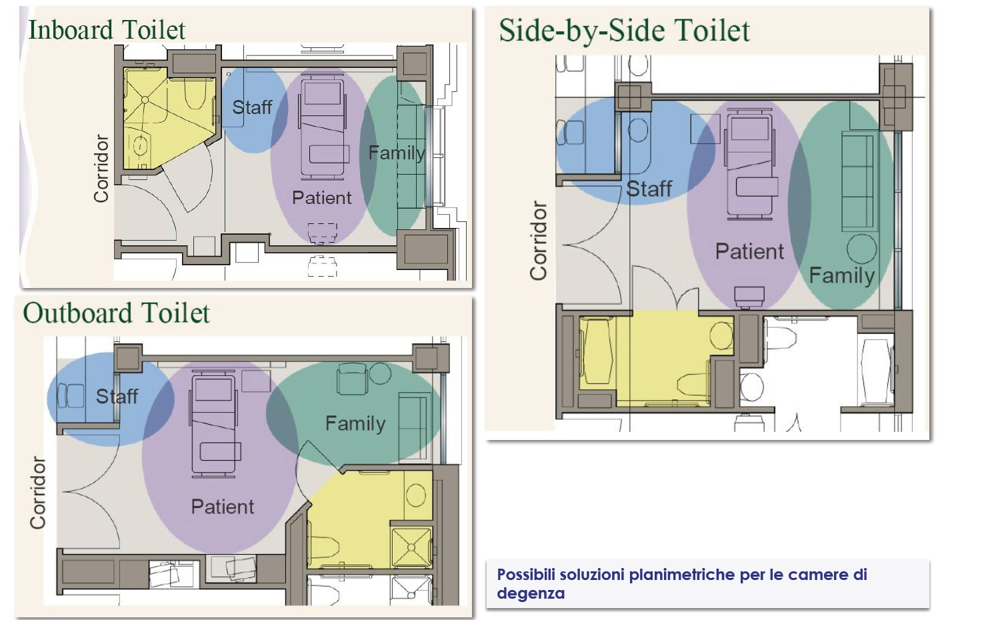
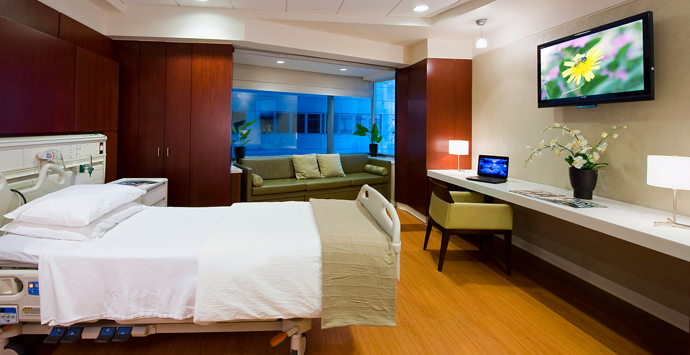

#Progettazione dei reparti di degenza di medicina generale, chirurgia e pediatria

#Giulia Clementi

  *  Introduzione
  *  Evoluzione nel design
  *  Normative
  *  Requisiti
  *  Dettaglio di realizzazione per le diverse unità ambientali

#Introduzione
##Terminologia
###Patient

* *Outpatient*: paziente che visiti la clinica o l'ospedale per diagnosi o trattamenti di durata inferiore a ventiquattro ore;
* *Inpatient* o *degente*: paziente che si trattenga nell'ospedale per un tempo determinato, in genere diversi giorni o qualche settimana, oppure anni ad esempio nel caso di pazienti in coma;
* *Day-patient*: usufruisce dei servizi dell'ospedale ma non si trattiene la notte.      

###Inpatient ward

* Reparto di ospedale che offra letti per degenti. Pazienti con simili esigenze di trattamento sono collocati nella stessa divisione.

##Esigenze dei fruitori

* Decoro / privacy / spazio personale
* Opportunità di socializzazione
* Sicurezza e controllo di infezioni
* Qualità della luce giornaliera
* Vista all'esterno / paesaggio /attività
* Spazio al di la del letto per famiglia ed amici
* Ventilazione naturale e qualità dell'aria
* Controllo del paziente da parte dello staff

##Evoluzione nell'architettura

**Legenda**: 

Dormitori *'nightingale'*, 1930 circa: ogni camerata ospita fino a 36 letti. Le finestre sono su entrambi i lati, accanto ai letti, pertanto i pazienti sono esposti a correnti d'aria e luce forte sugli occhi. Lo staff ha un tavolo/scrivania in una stanza ad un capo del dormitorio. Di fronte un servizio igienico. Dall'altro lato del dormitorio una sala comune di ritrovo. Problema evidente è quello della mancanza di privacy per i parienti. In versioni successive sono previste alcune camere più piccole o singole per pazienti con infezioni.

Divisione in *'bays'*, 1980 circa: ogni bay ospita 6, a volte 4 letti, in stanze situate lungo un corridoio principale, con sanitari e sale per il personale sul lato opposto. Un'unità di cura consiste di quattro o cinque bays ed una sala infermieri e quattro camere singole.
I vantaggi principali:

* Il traffico principale è separato dalle zone con i letti;
* I pazienti hanno le finestre di lato perciò non soffrono per i raggi solari;
* Maggiore privacy.

*Stanze individuali*, ospedali in costruzione: la scelta è guidata dalle crescenti aspettative dei pazienti, dalla necessità di privacy e dalla nascita dei 'superbug', ceppi di batteri che hanno sviluppato resistenza agli antibiotici. I contro di questa organizzazione sono la crescita della superficie necessaria e dei costi di realizzazione. L'idea che la supervisione di stanze singole richieda più staff è stata rigettata.
I vantaggi principali:

* Maggior controllo delle infezioni;
* Minimizzazione dei trasferimenti dei pazienti;
* Le ammissioni possono essere effettuate durante tutto l'arco della giornata senza disturbare gli altri pazienti;
* Tranquillità e silenzio per dormire;
* Controllo dell'ambiente;
* Privacy per pratiche culturali e religiose;
* Confidenzialità ed apertura nell'informare i pazienti;
* Privacy e decoro;
* Migliore contatto con familiari e staff.

##Aspetti dimensionali - Requisiti delle sale di degenza

* Dimensioni minime per letto 6mq*;
* Altezza minima del vano 3,20m*;
* Dimensioni minime camere da letto singole 9mq*;
* Dimensioni minime delle vetrate 2mq*.

 \* Pubblicato nella Gazzetta Ufficiale della Repubblica Italiana n.187

**Camere singole**: superficie di 17mq per la stanza e circa 3,6mq per il bagno corrisponde alla possibilità per un paziente di soggiornare in compagnia di un parente, soprattutto per quanto rigurda il reparto pediatrico.

**Camere doppie**: superficie di 23mq per la camera e doppi servizi di 3,6mq

##Caratteristiche ambientali

* **Luminosità**: illuminazione generale 150-200 lux, illuminazione per esaminare i pazienti 500-750-1000 lux
* **Ventilazione naturale** garantita dalle finestre
* **Comfort termico** ed acustico garantito da pareti insonorizzate ed impianto di climatizzazione

##Aspetti funzionali

* Posizione del servizio igienico all’interno della stanza

* Partizioni interne di tipo mobile per garantire la privacy nelle stanze doppie pur favorendo la socializzazione
* Infissi esterni e sistemi di oscuramento: vetri oscurati

##Qualità dei materiali di finitura

* Punto di vista igienico: tutte le superfici devono essere lavabili
* Qualità estetica: colori e materiali selezionati per trasmettere all'utente un senso di accoglienza e naturalità
* Sicurezza
* In ogni camera le reti impiantistiche sono posate dietro pannelli removibili in legno

##Tipologia degli arredi

* Ergonomia
* Praticità manutentiva
* Valore estetico

##Caso di studio: American Hospital Dubai

###Stanza singola

###Sala con nurse station per informazioni e attesa dei visitatori all'ingresso del reparto

###Sala comune per pazienti

###Sala comune per bambini
Si tratta di un ambiente che contiene molti giochi per bambini e un piccolo palco per produzioni teatrali. I bambini hanno un grande beneficio nello stare insieme.

###Sala per lo staff
Provvista di computer

